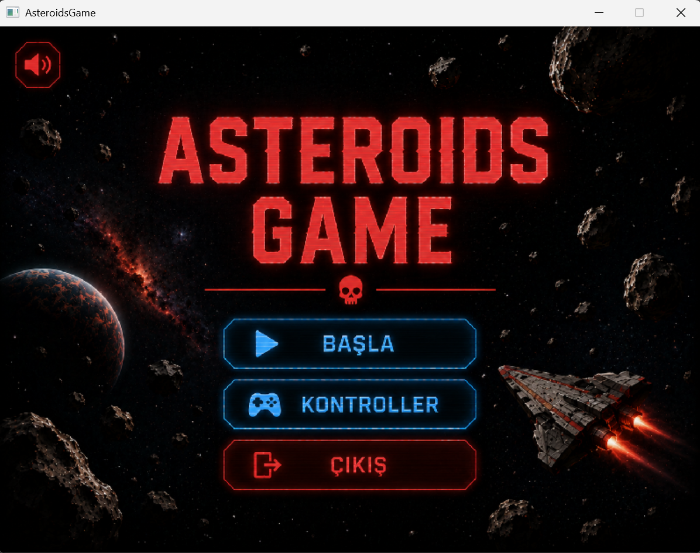
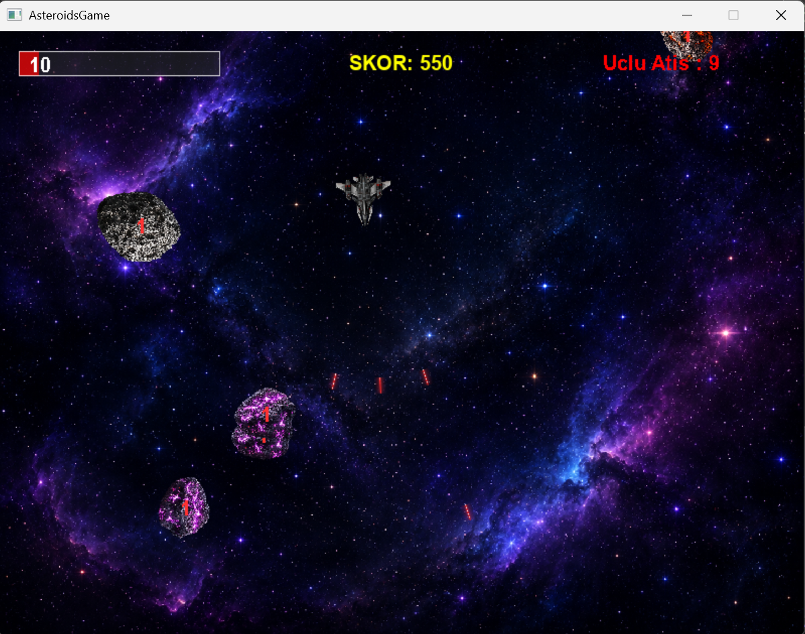

# ☄️ AsteroidsGame: Uzayda Hayatta Kalma


Bu proje, C programlama dili ve SDL2 kütüphanesi kullanılarak sıfırdan geliştirilmiş, 2D uzay hayatta kalma oyunudur. Kocaeli Üniversitesi akademik projesi kapsamında geliştirilmiş olup, fizik mekanikleri ve zorluk seviyeleri içermektedir.

## Ekran Görüntüleri ve Oynanış Videosu




## Oyun Ozellikleri

* **Modüler Mimari :** Proje tek bir dosyaya yığılmamış; arayüz, çarpışma, fizik ve yapay zeka sistemleri bağımsız `.h` ve `.c` dosyalarına bölünmüştür.
* **Zorluk Sistemi:** Oyuncu her 500 puana ulaştığında oyun hızı, meteorların dayanıklılığı ve doğma sıklığı otomatik olarak artar.
* **Meteor Parçalanması:** Belirli bir büyüklüğün üzerindeki meteorlar yok edildiğinde, rastgele açılar ve hızlarla daha küçük meteorlara bölünerek oyun alanına saçılır.
* **Çarpışma :** Mermi ve meteor etkileşimleri hesaplanır. Gemi hasar aldığında çarpışma yönüne göre savrulur.
* **Güçlendirmeler :** Uzaydan düşen özel kutular sayesinde gemiye geçici kalkan veya 10 saniyelik 3'lü Lazer yeteneği kazandırılabilir.
* **Kalıcı Skor Sistemi:** En yüksek skor yerel diske kaydedilir ve oyun kapansa dahi korunur.

## Oynanış

Amacınız uzay boşluğunda geminizi hayatta tutarak üzerinize gelen meteor dalgalarını yok etmektir. Ekranın dışına çıkan objeler ekranın diğer tarafından geri gelir. Oyun ilerledikçe hayatta kalmak zorlaşır; doğru zamanda güçlendirmeleri toplamak ve geminin mekaniklerini iyi kullanmak sizi daha fazla hayatta tutar. Canınız sıfıra düştüğünde oyun biter.

## Kontroller

* **W / Yön Tuşu Yukarı:** İleri git
* **A - D / Sağ - Sol Yön Tuşları:** Gemiyi döndür
* **S / Yön Tuşu Aşağı:** Geri git
* **L-SHIFT:** Fren 
* **BOŞLUK (Space):** Lazer ateşle
* **ESC:** Oyunu Duraklat / Menü
* **F11:** Tam Ekran 

## Kurulum ve Çalıştırma

Oyunu kendi bilgisayarınızda derlemek ve oynamak için aşağıdaki adımları izleyebilirsiniz.

### 1. Gereksinimler
* C Derleyicisi (GCC/MinGW veya MSVC)
* **SDL2 Kütüphaneleri:** `SDL2`, `SDL2_image`, `SDL2_mixer`, `SDL2_ttf`

### 2. Projeyi Klonlama
Terminal veya PowerShell üzerinden projeyi bilgisayarınıza indirin:

```bash
git clone https://github.com/softwareharun/Asteroids-donem-projesi.git
```

### 3. Derleme ve Çalıştırma

Projenin modüler yapısından (`.c` ve `.h` dosyalarının ayrılmış olmasından) dolayı, derleme işlemini kullandığınız ortama göre aşağıdaki yöntemlerden biriyle yapabilirsiniz:

**Seçenek A: CMake İle (Önerilen)**
Proje ana dizininde `CMakeLists.txt` yapılandırması mevcuttur. VS Code, Visual Studio veya CLion gibi modern bir IDE ile klasörü açtığınızda sistem projeyi otomatik algılar. IDE'nizin "Build" (Derle) butonuna basarak saniyeler içinde çalıştırabilirsiniz.

**Seçenek B: GCC / MinGW (Terminal Üzerinden)**
Terminali oyunun ana klasöründe açın ve projeyi oluşturan tüm modülleri tek seferde derlemek için şu komutu çalıştırın:
```bash
gcc main.c arayuz.c carpisma.c gemiVeMermi.c meteor.c -o AsteroidsGame -lmingw32 -lSDL2main -lSDL2 -lSDL2_image -lSDL2_mixer -lSDL2_ttf
```
Derleme tamamlandıktan sonra oyunu başlatmak için:
```bash
./AsteroidsGame.exe
```

**Seçenek C: Visual Studio (Manuel Kurulum)**
1. Boş bir C++ projesi açıp klasördeki tüm `.c` ve `.h` dosyalarını projeye dahil edin.
2. Proje Özellikleri (Properties) kısmından SDL2 `include` dizinlerini (C/C++ -> General) ve `lib` dizinlerini (Linker -> General) tanıtın.
3. Linker -> Input -> Additional Dependencies kısmına gerekli SDL2 kütüphanelerini ekleyip F5 ile çalıştırın.

## Kullanılan Kütüphaneler

* **C Programlama Dili:** Oyunun temel algoritması ve motor mimarisi.
* **SDL2:** Pencere yönetimi, donanım hızlandırmalı (Renderer) grafik çizimleri.
* **SDL2_image:** Şeffaf PNG dokularının (Texture) işlenmesi.
* **SDL2_mixer:** Çok kanallı SFX (patlama, lazer, motor sesi) ve arka plan müziği yönetimi.
* **SDL2_ttf:** Ekrana dinamik yazı (Can, Skor, HP) basımı.

## Teşekkürler ve Kaynaklar

Bu projenin geliştirilme ve test aşamalarında aşağıdaki kişi ve kaynaklardan destek alınmıştır:

* **Grafik ve Ses Varlıkları:** Oyunda kullanılan uzay gemisi, kalkan, meteor tasarımları ve ses efektleri [Kenney.nl, Freesound.org, Pixabay.com] üzerinden telifsiz / lisanslı olarak temin edilmiştir.
* **Arayüz Fontu:** Oyun içi skor ve menülerde kullanılan yazı tipi Arial yazı tipidir.
* **Teknik Destek ve Fikir Alışverişi:** Oyunun modüler mimarisinin kurulmasında, çarpışma algoritmalarının test edilmesinde ve oyun mekaniklerinin geliştirilmesinde bana destek olan [Gemini.com, Arkadasim Zeynep] teşekkür ederim.

## Lisans

Eğitim ve kişisel gelişim amaçlı serbestçe kullanılabilir ve değiştirilebilir.